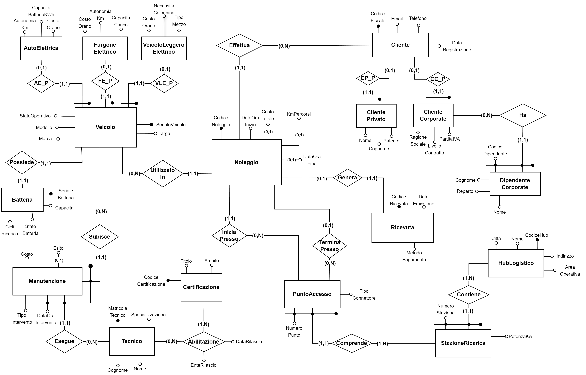

# ⚡ EcoFleet Solutions

<p align="center">


</p>

---

## 📖 Overview

**EcoFleet Solutions** is a PostgreSQL database project developed for the **Database Systems** course.

The project models a complete electric mobility sharing platform, allowing the management of:

- 🚗 Electric vehicles
- 🔋 Batteries
- 👥 Private and corporate customers
- 🏢 Corporate employees
- ⚡ Charging stations
- 📍 Access points
- 📅 Rentals
- 🔧 Maintenance operations
- 👨‍🔧 Certified technicians

The project includes the complete database design process, from requirements analysis to implementation in PostgreSQL, together with a C application that interacts with the database using **libpq**. :contentReference[oaicite:1]{index=1}

---

# ✨ Main Features

- Complete Entity-Relationship design
- Logical database design
- PostgreSQL implementation
- Database normalization
- Domains and constraints
- Primary and foreign keys
- Triggers and stored functions
- Index optimization
- Complex SQL queries
- Command-line application written in C

---

# 🏗️ Database Architecture

The system manages:

- Electric vehicle fleet
- Charging infrastructure
- Rental lifecycle
- Maintenance scheduling
- Corporate contracts
- Customer management
- Battery monitoring
- Payment receipts

The database has been designed to ensure data consistency through foreign keys, check constraints, domains, triggers and business rules. :contentReference[oaicite:2]{index=2}

---

# 🛠️ Technologies

| Technology | Purpose |
|------------|---------|
| PostgreSQL | Database |
| SQL | Database implementation |
| C | Client application |
| libpq | PostgreSQL client library |

---

# 📂 Repository Structure

```text
.
├── docs/
│   └── Relazione Progetto EcoFleet.pdf
│
├── sql/
│   └── ecofleet.sql
│
├── src/
│   └── C application
│
└── README.md
```

---

# 📊 SQL Features

The SQL implementation includes:

- Database schema
- Sample dataset
- Domains
- Constraints
- Indexes
- Stored functions
- Triggers
- Analytical queries

The project also implements optimization techniques such as indexes and planned redundancy to improve query performance. :contentReference[oaicite:3]{index=3}

---

# 🔍 Example Queries

Some of the implemented queries include:

- Vehicle usage statistics
- Total spending by private customers
- Rental analysis by city
- Vehicles currently under maintenance
- Battery usage ranking

:contentReference[oaicite:4]{index=4}

---

# 📄 Documentation

The complete report includes:

- Requirements analysis
- Conceptual design
- ER Diagram
- Logical design
- Relational schema
- PostgreSQL implementation
- SQL optimization
- Trigger design
- C application

---

# Entity-Relationship Diagram

<p align="center">
  
</p>

# 🎓 Academic Context

This project was developed as part of the **Database Systems** course at the **University of Padua**.

The objective was to design, implement and optimize a relational database starting from a real-world scenario, following the complete database design methodology.

---

# 👨‍💻 Authors

- Pietro Leonardo Acampora
- Luca Artinian